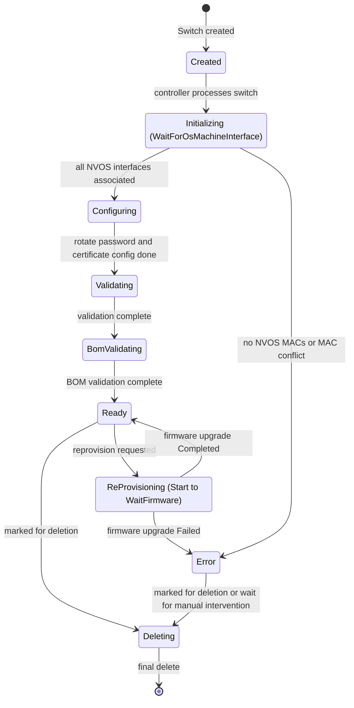

# Switch State Diagram

This document describes the Finite State Machine (FSM) for Switches in NICo: lifecycle from creation through configuration, validation, ready, optional reprovisioning, and deletion.

## High-Level Overview

The main flow shows the primary states and transitions:

## States

| State | Description |
|-------|-------------|
| **Created** | Switch record exists in NICo; awaiting first controller tick. |
| **Initializing** | Controller waits for expected switch NVOS MAC associations. Sub-state: `WaitForOsMachineInterface`. |
| **Configuring** | Switch is being configured. Sub-states: `ConfigureCertificate` (`Start` → `WaitForComplete { job_id }`), then `RotateOsPassword`. See [Switch Certificate Configuration](switch_configure_certificate.md). |
| **Validating** | Switch is being validated. Sub-state: `ValidationComplete`. |
| **BomValidating** | BOM (Bill of Materials) validation. Sub-state: `BomValidationComplete`. |
| **Ready** | Switch is ready for use. From here it can be deleted, or reprovisioning can be requested. |
| **ReProvisioning** | Reprovisioning (e.g. firmware update) in progress. Sub-states: `Start`, `WaitFirmwareUpdateCompletion`. Completion is driven by `firmware_upgrade_status` (Completed → Ready, Failed → Error). |
| **Error** | Switch is in error (e.g. firmware upgrade failed or NVOS MAC conflict). Can transition to Deleting if marked for deletion; otherwise waits for manual intervention or ReProvisioning to take machine out of Error |
| **Deleting** | Switch is being removed; ends in final delete (terminal). |

## Transitions (by trigger)

| From | To | Trigger / Condition |
|------|-----|----------------------|
| *(create)* | Created | Switch created |
| Created | Initializing (WaitForOsMachineInterface) | Controller processes switch |
| Initializing (WaitForOsMachineInterface) | Configuring (ConfigureCertificate Start) | All NVOS interfaces associated for expected switch |
| Initializing (WaitForOsMachineInterface) | Error | Expected switch has empty `nvos_mac_addresses` or MAC owned by another switch |
| Configuring (ConfigureCertificate Start) | Configuring (ConfigureCertificate WaitForComplete) | CM returns RMS job id (`domain_name` = `rack_id`) |
| Configuring (ConfigureCertificate Start) | Configuring (RotateOsPassword) | No `rack_id` or no component manager (skip) |
| Configuring (ConfigureCertificate WaitForComplete) | Configuring (RotateOsPassword) | RMS job `Completed` |
| Configuring (ConfigureCertificate WaitForComplete) | Error | RMS job `Failed` |
| Configuring (RotateOsPassword) | Validating (ValidationComplete) | NVOS credentials stored or already in vault |
| Configuring (RotateOsPassword) | Error | No expected switch or missing BMC MAC |
| Validating (ValidationComplete) | BomValidating (BomValidationComplete) | Validation complete |
| BomValidating (BomValidationComplete) | Ready | BOM validation complete |
| Ready | Deleting | `deleted` set (marked for deletion) |
| Ready | ReProvisioning (Start) | `switch_reprovisioning_requested` is set |
| ReProvisioning (Start) | ReProvisioning (WaitFirmwareUpdateCompletion) | Reprovision triggered |
| ReProvisioning (WaitFirmwareUpdateCompletion) | Ready | `firmware_upgrade_status == Completed` |
| ReProvisioning (WaitFirmwareUpdateCompletion) | Error | `firmware_upgrade_status == Failed { cause }` |
| Error | Deleting | `deleted` set (marked for deletion) | ReProvisioning
| Deleting | *(end)* | Final delete committed |

## Implementation

- **State type**: `SwitchControllerState` in `crates/api-model/src/switch/mod.rs`.
- **Handlers**: `crates/switch-controller/src/` — one module per top-level state (`created`, `initializing`, `configuring`, `validating`, `bom_validating`, `ready`, `reprovisioning`, `error_state`, `deleting`).
- **Certificate configuring design**: [switch_configure_certificate.md](switch_configure_certificate.md).
- **Orchestration**: `SwitchStateHandler` in `handler.rs` delegates to the handler for the current `controller_state`.
