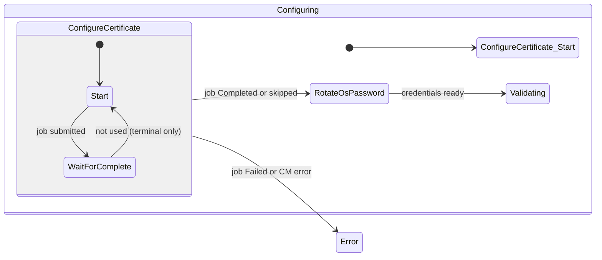
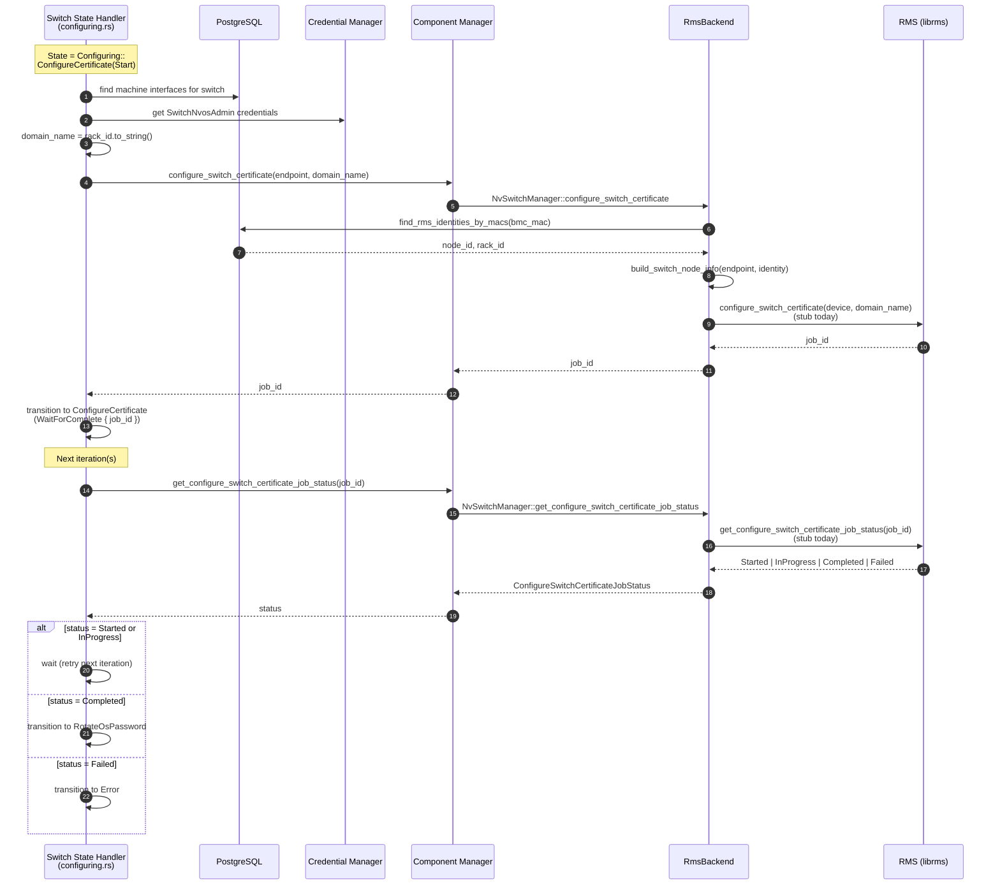
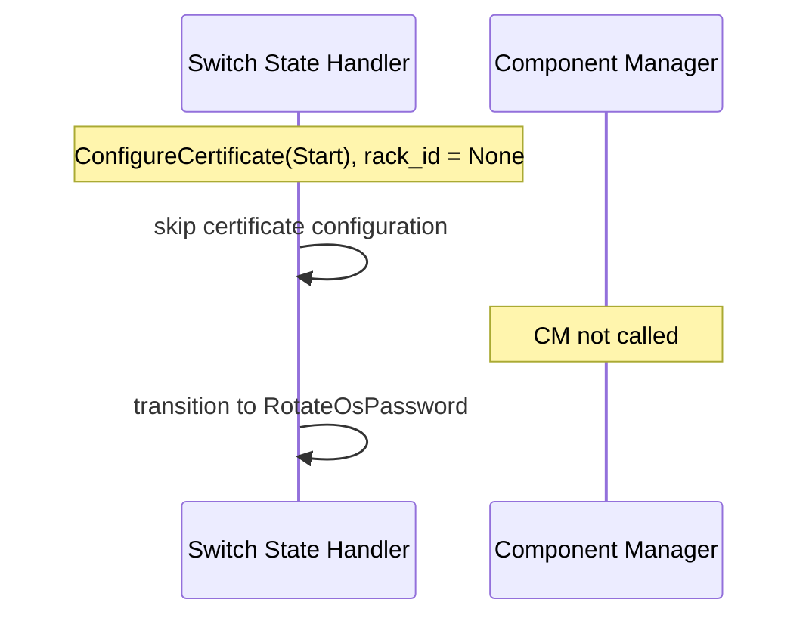
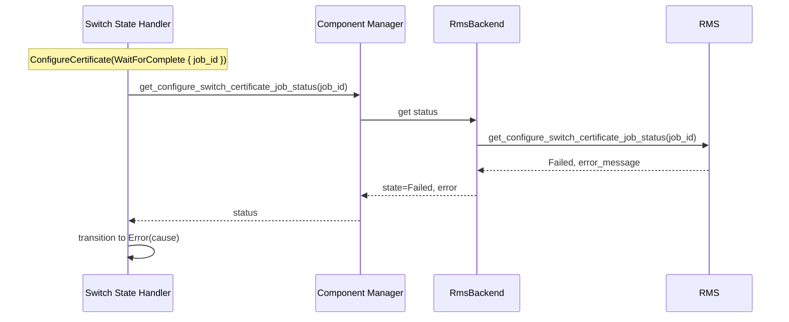

# Switch Certificate Configuration (ConfigureCertificate)

This document describes how the switch state controller configures switch TLS
certificates during the **Configuring** phase. The handler delegates device
operations to **Component Manager (CM)**, which in turn calls **Rack Manager
Service (RMS)** asynchronously and polls job status until completion.

## Goals

- Install or rotate the switch NVOS certificate as part of initial switch
  bring-up, before NVOS admin credentials are stored (`RotateOsPassword`).
- Keep RMS-specific protobuf and job semantics behind the CM `NvSwitchManager`
  abstraction so the state handler stays backend-agnostic (RMS, NSM, mock).
- Persist the async **job id** in controller state so restarts can resume polling.

## Placement in the Switch FSM

`ConfigureCertificate` is a sub-state of `SwitchControllerState::Configuring`,
before `RotateOsPassword` and before `Validating`.



### Sub-states (`ConfigureCertificateState`)

| Sub-state | Purpose |
|-----------|---------|
| `Start` | Resolve switch endpoint, derive `domain_name`, call CM to start RMS job. |
| `WaitForComplete { job_id }` | Poll CM → RMS for job status until terminal. |

Job status values use `ConfigureSwitchCertificateState`: `Started`,
`InProgress`, `Completed`, `Failed`.

## Domain name (`domain_name`)

The state handler does **not** read site config for a certificate path. On
`Start`, it sets:

```text
domain_name = switch.rack_id.to_string()
```

| Condition | Behavior |
|-----------|----------|
| `rack_id` is `None` | Skip certificate configuration; transition to `RotateOsPassword`. |
| Component manager not configured | Skip certificate configuration; transition to `RotateOsPassword`. |
| `bmc_mac_address` is `None` | Transition to `Error`. |
| CM returns error on start | `StateHandlerError` (handler retries on next iteration). |

RMS is expected to interpret `domain_name` as the site-local certificate
identifier (for example a vault secret name or catalog entry keyed by rack).

## Component Manager API

CM exposes two methods used by the switch configuring handler:

| Method | Input | Output |
|--------|-------|--------|
| `configure_switch_certificate` | `SwitchEndpoint`, `domain_name: &str` | `job_id: String` |
| `get_configure_switch_certificate_job_status` | `job_id: &str` | `ConfigureSwitchCertificateJobStatus { state, error }` |

`SwitchEndpoint` is built from:

- Switch BMC MAC (required)
- First associated NVOS machine interface (MAC + IP if present)
- NVOS admin credentials from the credential vault (`SwitchNvosAdmin`)

### Backend matrix

| Backend | `configure_switch_certificate` | `get_configure_switch_certificate_job_status` |
|---------|----------------------------------|-----------------------------------------------|
| **RMS** (`RmsBackend`) | Resolve RMS node identity from DB; call RMS (stub today). | Poll RMS job status (stub today). |
| **Mock** | Returns `"mock-switch-cert-job"`. | Returns `Completed`. |
| **NSM** | `InvalidArgument` (not supported). | `InvalidArgument` (not supported). |

## RMS integration

### Identity resolution (RMS backend only)

Before calling RMS, `RmsBackend`:

1. Looks up `switch.id` and `switch.rack_id` via `find_rms_identities_by_macs`.
2. Builds `rms::NewNodeInfo` from the `SwitchEndpoint` and resolved identity.
3. Passes `domain_name` and device info to RMS.

If the switch has no `rack_id` in the database, identity resolution fails and CM
returns an internal error (the state handler normally skips earlier when
`switch.rack_id` is unset).

### Planned RMS RPCs (not yet in `librms`)

The current implementation uses **stubs** in
`crates/component-manager/src/rms.rs` until these RPCs exist in
`nv-rms-client`:

| RPC | Request (conceptual) | Response (conceptual) |
|-----|----------------------|------------------------|
| `configure_switch_certificate` | Device (`NewNodeInfo`), `domain_name` | `job_id`, status |
| `get_configure_switch_certificate_job_status` | `job_id` | `ConfigureSwitchCertificateState`, optional error message |

Stub behavior today:

- Start returns job id `"stub-switch-cert-job"`.
- Status poll returns `Completed` immediately.

## Sequence diagrams

### Happy path (RMS backend)

One state-controller iteration runs `Start`; a later iteration runs
`WaitForComplete` until RMS reports completion.



### Skip path (no rack association)



### Error path (job failed)



## Persistence

Controller state is stored in `switches.controller_state` (JSON). Example
after job submission:

```json
{
  "state": "configuring",
  "config_state": {
    "ConfigureCertificate": {
      "configure_certificate": {
        "WaitForComplete": {
          "job_id": "stub-switch-cert-job"
        }
      }
    }
  }
}
```

The job id is **only** in controller state (unlike rack firmware upgrade, which
also stores a separate `firmware_upgrade_job` row). This is sufficient for a
single-switch, single-job certificate operation.

## Implementation map

| Layer | Location |
|-------|----------|
| State types | `crates/api-model/src/switch/mod.rs` — `ConfigureCertificateState`, `ConfiguringState` |
| Job status enum | `crates/api-model/src/component_manager.rs` — `ConfigureSwitchCertificateState` |
| State handler | `crates/switch-controller/src/configuring.rs` |
| CM facade | `crates/component-manager/src/component_manager.rs` |
| CM trait | `crates/component-manager/src/nv_switch_manager.rs` |
| RMS backend | `crates/component-manager/src/rms.rs` |
| Tests | `crates/api-core/src/tests/switch_state_controller/mod.rs` |

## Testing

Integration tests cover:

- Skip when `rack_id` or component manager is absent → `RotateOsPassword`
- `Start` → `WaitForComplete` with mock CM
- `WaitForComplete` → `RotateOsPassword` on success
- `WaitForComplete` → `Error` on failed job status
- `ConfigureCertificate` (completed or skipped) → `RotateOsPassword` → `Validating`

Run with `DATABASE_URL` set (sqlx test harness), filter:
`cargo test -p carbide-api-core configure_certificate`.

## Future work

1. Replace RMS stubs with real `librms` RPCs when published.
2. Map RMS job states to `ConfigureSwitchCertificateState` explicitly (mirror
   `map_rms_firmware_job_state` pattern).
3. Decide whether NSM backend should support certificate configuration or remain
   explicitly unsupported.
4. Align `domain_name` semantics with site certificate catalog / vault naming once
   RMS contract is finalized.
