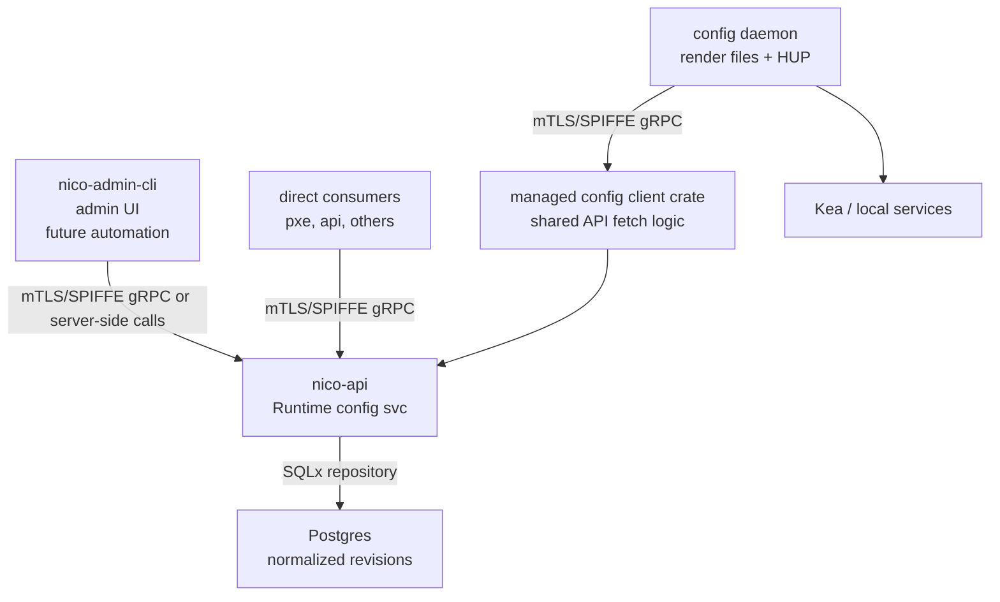
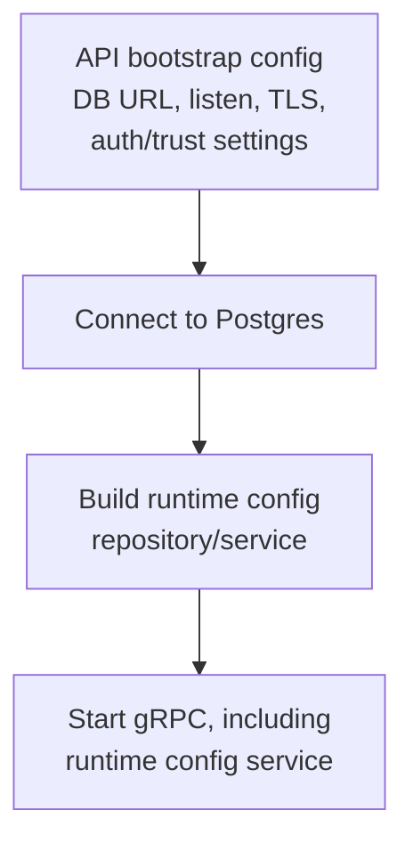
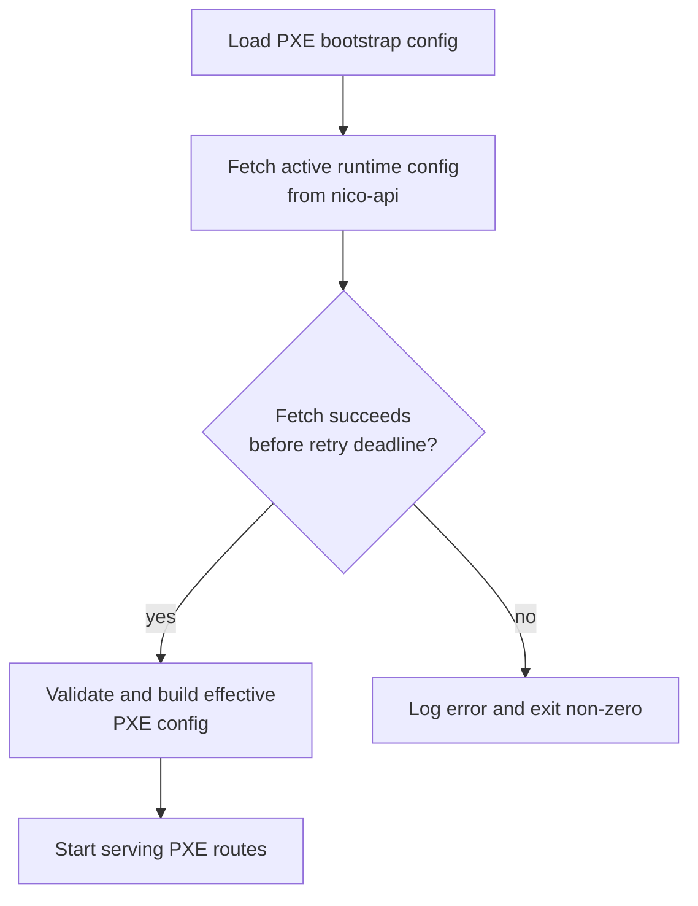
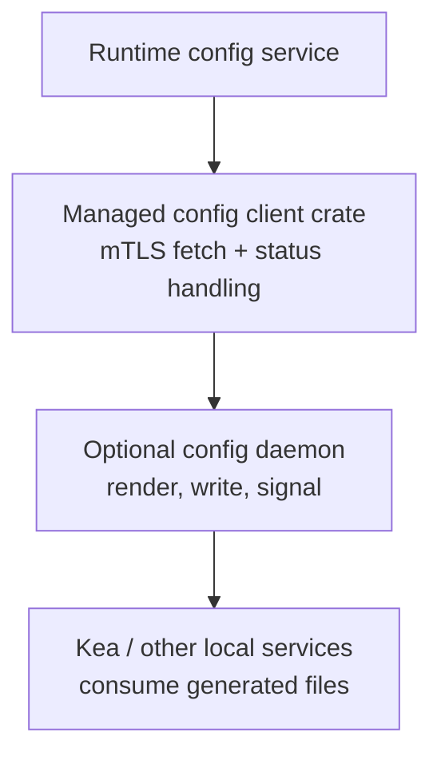
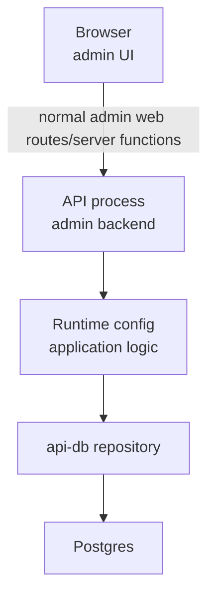

# Runtime Configuration Service Design

## Status

Design proposal and phased implementation plan. The phases start with a small
first implementation, but the architecture is intended to grow into a general
runtime configuration system for NICo services.

## Glossary

- **Runtime configuration:** Configuration that a service can read after the
  API is running and the trust boundary is available. Phase 1 stores this in
  Postgres and exposes it through the API process.
- **Bootstrap configuration:** Local configuration required before a service can
  fetch runtime configuration. Examples include database URLs, listen addresses,
  TLS paths, SPIFFE trust roots, and the API/config-service endpoint.
- **Effective configuration:** The in-process configuration a service actually
  uses after combining local bootstrap config with fetched runtime config.
- **Config document:** The admin-authored JSON input that describes desired
  runtime settings. It contains `schema_version`, but not the server-assigned
  runtime config revision.
- **Schema version:** The version of the admin JSON document shape. It lets the
  server parse older input formats when fields are later renamed, split, or
  restructured.
- **Revision:** An immutable applied runtime configuration snapshot. Each apply
  creates a new revision. Phase 1 retains all revisions; a future retention
  cleanup workflow may bound how many complete revisions remain available.
- **`ConfigVersion`:** The existing repository type used as the externally
  visible revision identifier, for example `V5-T1760000000000000`.
- **`version_nr`:** A numeric revision ordering column stored separately from
  `ConfigVersion` so SQL queries can sort and allocate revisions without parsing
  version strings.
- **Full snapshot:** An apply payload contains the complete desired config, not
  a patch. The server stores all section rows for the new revision in one
  transaction.
- **Active pointer:** A database row that identifies which immutable revision is
  currently active for readers.
- **Retained configuration:** A revision whose full normalized section rows are
  still available for reads, diffs, and future rollback workflows.
- **Retained revision limit:** The maximum number of full configuration
  revisions to keep once future retention cleanup exists. The active revision is
  always retained.
- **Global scope:** The only supported Phase 1 scope. Future work may add site,
  rack, environment, tenant, or profile dimensions.
- **Direct consumer:** A NICo-owned service that can call the API and consume
  typed runtime config directly, such as `nico-pxe`.
- **File-based service:** A service that should receive centrally managed config
  through rendered local files and process signaling instead of direct runtime
  API calls. Kea is the main example.
- **Managed config client crate:** A future reusable Rust crate that owns the
  common mTLS/API client, fetch, status handling, and validation-helper logic for
  consumers that need managed config.
- **Config daemon:** A future local component that fetches runtime config,
  renders service-specific files, validates them, atomically writes them, and
  HUPs or restarts the target process.
- **Last-writer-wins:** The Phase 1 apply model where concurrent applies may
  both succeed and the transaction that commits last becomes active.
- **Last-known-good:** The most recent config a consumer or daemon successfully
  validated and applied. Future hot reload flows should keep using it when a
  newer config cannot be fetched or validated.
- **Hot reload:** Applying selected runtime settings without restarting the
  process. Phase 1 designs for this but does not implement polling, watches, or
  in-process reload.
- **Rollback:** A future audited operation that creates a new revision from an
  older revision's effective config and activates the new revision.
- **SPIFFE/mTLS:** The existing service-to-service trust model used for
  privileged API communication.
- **AEAD/AAD:** Future secret-storage terms. AEAD is authenticated encryption;
  AAD is non-secret associated data bound into encryption integrity checks.

## Long-term goals

- Store NICo application runtime configuration in Postgres.
- Expose active runtime configuration through the API process over gRPC.
- Provide supported administrative write paths instead of requiring raw SQL.
- Keep config strongly typed at service boundaries and in code.
- Preserve retained history for recent config changes, including the full
  configuration data required for diff and rollback workflows.
- Allow selected settings to be applied without restarting processes.
- Support a future admin UI for human configuration workflows.
- Support services that consume config directly, and services that require local
  rendered config files plus process reloads.

## Long-term non-goals

- Storing bootstrap values that are required before the API or trust boundary is
  available.
- Storing raw secrets such as private keys, passwords, or tokens.
- Making browsers call privileged gRPC APIs directly in the initial UI design.
- Replacing every existing configuration source in one migration.

## Configuration ownership boundary

The runtime configuration service owns settings that can be read after the API
has started and connected to Postgres. It must not own values required to start
the API or establish the trust boundary used to reach it.

Keep these values local in env, files, Helm values, or existing service-specific
bootstrap config:

- database connection strings,
- listen addresses and ports,
- TLS certificate, key, and trust-root paths,
- auth and SPIFFE trust configuration,
- the API/config-service endpoint a consumer needs before it can fetch runtime
  config,
- any value needed before `nico-api` can connect to Postgres and serve gRPC.

The runtime configuration service may own:

- service URLs and runtime endpoint references,
- behavior knobs,
- feature flags,
- non-secret integration settings,
- rendered-file source data for future config-daemon workflows,
- metadata used by admin UI and operational workflows.

## Target architecture

The API process owns database access and exposes the runtime configuration API.
Services either consume typed config directly through the API or rely on a local
daemon[^config-daemon] to render config into files and signal local processes.

[^config-daemon]: See
    [managed config client and config daemon](#managed-config-client-and-config-daemon)
    for the future file-rendering and process-signaling design.



The API must not call its own gRPC endpoint during startup. Internal API code
that needs runtime config should call the repository/application service layer
directly after Postgres is available.

## Data model principles

- Store applied configuration as immutable revisions.
- Store each revision in normalized tables, not JSONB blobs.
- Use the existing `ConfigVersion` type from `crates/config-version` for
  revision identifiers.
- Store `version_nr` separately so the database can order revisions without
  parsing the `ConfigVersion` string.
- Store an explicit active pointer from the first phase onward. Readers should
  ask "which revision is active?" instead of assuming the highest `version_nr`
  is active. This is slightly more complex, but it keeps the storage model ready
  for rollback, staged activation, and scoped active revisions later.
- Defer bounded retention cleanup until after Phase 1. Phase 1 should retain all
  applied revisions so history, diff, and future rollback have complete data.
- Use full snapshots for administrative apply operations.
- Reject unknown fields in admin input.
- Keep config document `schema_version` separate from applied config revision.
- Keep Phase 1 global-only. Do not add site, rack, environment, tenant, or
  profile columns until a concrete scope requirement exists; call out those
  future dimensions in the roadmap instead.
- Treat server-side validation as authoritative. CLI, UI, and daemon-side checks
  can improve UX and safety, but the API service decides whether a config
  revision may be written or activated.
- Support the current and previous admin JSON schema versions once more than one
  schema version exists.

## Admin JSON contract

Admin input is a full config document. It includes the config document schema
version, but not the server-owned runtime config revision.

Phase 1 input:

```json
{
  "schema_version": 1,
  "metadata": {
    "description": "default site runtime config"
  },
  "pxe": {
    "client_facing_api_url": "https://carbide-api.forge",
    "pxe_url": "http://carbide-pxe.forge",
    "static_pxe_url": "http://carbide-pxe.forge",
    "template_directory": "/opt/carbide/pxe/templates"
  }
}
```

Rules:

- `schema_version` is required and must be a supported schema version.
- Phase 1 supports only `schema_version = 1`.
- Unknown fields are rejected at every object level.
- `metadata.description` is optional.
- A missing `metadata` section, explicit `"metadata": null`, empty
  `"metadata": {}`, missing `metadata.description`, and explicit
  `"description": null` all produce the same stored metadata row with
  `description = NULL`.
- Phase 1 requires `pxe.client_facing_api_url`, `pxe.pxe_url`,
  `pxe.static_pxe_url`, and `pxe.template_directory`.
- The `pxe` section and required PXE fields must be present and non-null.
- `pxe.template_directory` must be a non-empty string after trimming. The API
  service does not validate that the path exists because the path is local to
  `nico-pxe`.
- Input JSON does not contain the runtime config `version`; the server assigns
  it when the snapshot is applied.

The schema version identifies the shape of the admin JSON document, not the
applied configuration revision. It gives future code a place to dispatch legacy
input formats if the JSON shape changes. For example, a future
`schema_version = 2` could split `pxe_url` into `boot_script_base_url` and
`static_artifact_base_url`; the server could parse v1 input and convert it to
the current internal model before storing normalized rows.

## Admin output contract

Human-readable CLI output can format the same data as tables. Machine-readable
metadata-rich output should separate server metadata from the re-applicable
config document:

```json
{
  "metadata": {
    "version": "V5-T1760000000000000",
    "version_nr": 5,
    "created_at": "2026-06-10T18:30:00Z",
    "created_by": "spiffe://example/admin-cli",
    "reason": "update PXE URL"
  },
  "config": {
    "schema_version": 1,
    "metadata": {
      "description": "default site runtime config"
    },
    "pxe": {
      "client_facing_api_url": "https://carbide-api.forge",
      "pxe_url": "http://carbide-pxe.forge",
      "static_pxe_url": "http://carbide-pxe.forge",
      "template_directory": "/opt/carbide/pxe/templates"
    }
  }
}
```

When `get --output-file` is intended to produce an editable file, it should
write only the input-shaped `config` document so operators can re-apply it
without editing server metadata.

## Versioning and apply semantics

Initial apply:

```sh
nico-admin-cli runtime-config apply --initial --file config.json --reason "bootstrap runtime config"
```

- Succeeds only if no runtime config revision exists.
- Creates `ConfigVersion::initial()`.
- Concurrent `--initial` applies on an empty database race on the inserted
  initial revision row. Exactly one apply may succeed; the loser should return
  gRPC `ALREADY_EXISTS`, not `INTERNAL`.

Normal apply:

```sh
nico-admin-cli runtime-config apply --file config.json --reason "update runtime config"
```

- Requires an existing runtime config revision.
- Uses last-writer-wins semantics.
- Loads the latest version, creates `current.increment()`, and inserts a new
  full snapshot revision.
- Does not require users to supply or copy a version string.
- Serializes concurrent normal applies on the server by locking the active
  pointer row in the apply transaction. If two applies race, both may succeed;
  the one that commits last becomes active, and the earlier one remains in
  history.

History records every retained apply, including the authenticated actor, the
operator-supplied reason, and the full configuration data needed to inspect,
diff, or roll back to that revision.

Last-writer-wins remains the administrative apply model until a future admin UI
introduces a safer interactive workflow. The CLI can add an interactive edit
flow later without requiring users to copy version strings into ordinary config
JSON.

Normal Phase 1 apply should not return `ABORTED` merely because the active
version changed during a concurrent apply. Reserve `ABORTED` for future
conditional or stale-edit workflows that explicitly submit an expected active
version.

## Phase 1 — API-hosted config service and PXE consumer

Phase 1 establishes the storage, API, admin CLI, and first consumer while
leaving the wider system unchanged.

### Scope

- API-hosted runtime configuration gRPC service.
- Normalized append-only DB tables.
- Top-level runtime config metadata section.
- PXE runtime section.
- Admin CLI apply, validate, get, show, and history commands.
- PXE startup fetch before serving.

### Non-goals

- Rollback.
- Hot reload, polling, or watch APIs.
- DHCP/Kea plugin changes.
- Additional scope dimensions.
- Admin UI.
- Migration of `CarbideConfig` (the existing `api-core` env-var-driven runtime
  configuration carrying API-internal behavior knobs such as `bypass_rbac`,
  `is_dpa_enabled`, and `retained_boot_interface_window`). Those fields are
  candidates for future phases but are out of scope for Phase 1. `nico-api` will
  not consume `ManagedConfigService` internally during Phase 1.

### Implementation decisions

- Use existing crates for the Phase 1 API-hosted service rather than creating a
  new runtime-config server crate. Domain types and conversions should live with
  the repo's existing model/API layering; persistence belongs in `api-db`, and
  service logic belongs in `api-core`. A future managed config client crate for
  file-based services is separate from this Phase 1 server-side decision.
- Admin `apply` and `validate` accept JSON so the server owns the admin file
  format. Consumer reads return typed protobuf messages.
- `reason` is required for every apply, including `--initial`.
- CLI may do lightweight JSON parsing for UX, but server validation is
  authoritative.
- `get --output-file` fails if the target exists unless the caller passes
  `--force`.
- `get --output-file` writes input-shaped JSON only. Normal CLI output follows
  existing admin-cli conventions: table output by default, JSON when requested
  through the existing output-format flag.
- PXE URLs must parse as URLs and use `http` or `https`.
- Missing active runtime config returns gRPC `FAILED_PRECONDITION` with a clear
  "runtime config has not been initialized"-style message.
- PXE retries startup config retrieval with bounded exponential backoff. If the
  retry deadline expires, PXE logs the config retrieval/validation failure, exits
  non-zero, and does not serve routes.
- PXE startup retry settings are bootstrap/local settings, not managed config
  settings, because they control how PXE reaches the managed config service.
- Phase 1 documents an example v1 JSON config for operators and tests.
- There is no automatic migration or seeding from existing environment values;
  operators apply the initial config explicitly.

### Design alternatives

- **Normalized tables vs. JSONB blob.** Each config section is stored in a typed
  column-per-field table rather than a single JSONB blob column. JSONB would
  simplify schema migration but prevents typed column reads, indexed queries, and
  future column-level retention or access control without parsing JSON in SQL.
  Normalized tables make the storage model ready for scoped config, per-section
  retention, and typed gRPC consumer reads without schema changes.
- **Server-authoritative vs. client-side-only validation.** Admin input is
  validated on the server; the CLI may do lightweight pre-checks for UX only.
  Client-only validation would create drift between CLI version and schema version,
  allowing malformed config to reach the API as CLI and server evolve
  independently.
- **Bounded startup retry vs. immediate fail-fast.** Phase 1 PXE startup fetches
  the active config with bounded exponential backoff before serving routes. This
  handles normal deployment ordering and short API/Postgres interruptions without
  requiring a supervisor restart loop for every transient failure. The retry has
  a maximum elapsed deadline; if the deadline expires, PXE exits non-zero rather
  than serving with partial config or waiting forever. Polling/watch after startup
  remains future work.
- **Last-writer-wins vs. compare-and-swap apply.** Normal apply uses
  last-writer-wins to avoid requiring callers to supply a current version.
  Compare-and-swap would prevent concurrent apply overwrites but adds UX friction;
  it is reserved for a future interactive `runtime-config edit` workflow.

### Database schema

Use normalized tables plus an explicit active pointer table. Each config
revision starts with a retained full configuration snapshot;
`runtime_config_active` is the small, mutable row that says which immutable
revision readers should use now.

Phase 1 supports only a single global active config, but the active pointer keeps
the storage model ready for later rollback, staged activation, and scoped config
without changing the read path. A future rollback can create a new revision from
an old snapshot and then move the active pointer to that new revision. A future
staged workflow can add candidate or pending pointers without changing how
normal readers find the active config.

Phase 1 does not delete old revisions. Every applied revision remains available
for history, inspection, and future diff/rollback workflows. Bounded retention
cleanup is future work.

```sql
-- One history row per applied runtime config snapshot. Phase 1 retains every
-- row and its corresponding normalized settings rows.
create table runtime_config_revision (
    version text primary key,
    version_nr bigint not null unique,
    schema_version integer not null,
    created_at timestamptz not null,
    created_by text not null,
    reason text not null
);

-- Top-level, human-oriented metadata for the runtime config snapshot. This is
-- not `carbide-api` configuration; future API-specific runtime settings should
-- use an explicit API section/table.
create table runtime_config_metadata_revision (
    version text primary key references runtime_config_revision(version) on delete restrict,
    description text
);

-- PXE runtime settings for a specific config revision. These values are fetched
-- from the runtime config service before `nico-pxe` starts serving routes.
create table runtime_config_pxe_revision (
    version text primary key references runtime_config_revision(version) on delete restrict,
    client_facing_api_url text not null,
    pxe_url text not null,
    static_pxe_url text not null,
    template_directory text not null
);

-- The active pointer tells readers which immutable revision is currently active.
-- Phase 1 supports only the global scope; the CHECK constraint prevents partial
-- scoped-config behavior before scope semantics are designed. The section-table
-- FKs make the active body non-prunable while this row points at it.
create table runtime_config_active (
    scope text primary key,
    version text not null,
    activated_at timestamptz not null,
    activated_by text not null,
    constraint runtime_config_active_revision_fk
        foreign key (version)
        references runtime_config_revision(version)
        on delete restrict,
    constraint runtime_config_active_metadata_fk
        foreign key (version)
        references runtime_config_metadata_revision(version)
        on delete restrict,
    constraint runtime_config_active_pxe_fk
        foreign key (version)
        references runtime_config_pxe_revision(version)
        on delete restrict,
    check (scope = 'global')
);
```

All tables for a new revision are inserted in one transaction. Validation must
complete before inserting any rows. If validation fails, the previous active
revision remains active. Initial apply inserts the first active pointer row.
Normal apply inserts a new revision and updates the active pointer in the same
transaction.

`on delete restrict` is intentional on the child-to-parent foreign keys from
`runtime_config_metadata_revision.version`, `runtime_config_pxe_revision.version`,
and `runtime_config_active.version` to `runtime_config_revision.version`.
`runtime_config_revision` rows are retained history with corresponding settings
rows, so ad hoc parent deletes must fail loudly instead of cascading away config
data or nulling the active pointer.

Those child-to-parent constraints do not, by themselves, prevent deleting rows
from `runtime_config_metadata_revision` or `runtime_config_pxe_revision`. The
active pointer therefore also has restricting foreign keys from
`runtime_config_active.version` to `runtime_config_metadata_revision.version`
and `runtime_config_pxe_revision.version`. Those constraints make accidental
deletion of the active metadata and PXE settings fail at the database level
while `runtime_config_active` still references that version.

Normal apply should lock the active pointer row while computing the next
`ConfigVersion`, for example with `select ... for update` on
`runtime_config_active where scope = 'global'`. This makes last-writer-wins
deterministic and prevents duplicate next-version allocation under concurrent
applies.

Future scoped configuration can replace the singleton active pointer with a
structured scope key, for example `scope_type` and `scope_id`, once a real scope
model is defined.

These tables are delivered as a single versioned sqlx migration in
`crates/api-db/migrations/` using the existing timestamp-based naming convention
(e.g., `20260609232431_description.sql`).

### gRPC methods

Phase 1 should add one runtime configuration service to the existing API gRPC
surface. Admin write methods accept the admin JSON document as a UTF-8 string so
the server remains the authoritative parser and validator for the admin input
format. Consumer read methods return strongly typed protobuf messages, not
generic JSON.

Do not name any new protobuf message `RuntimeConfig`. `forge.proto` already has
an existing top-level `RuntimeConfig` message used by `BuildInfo.runtime_config`
for the redacted API process config exposed by the `Version` RPC. The new
central runtime configuration protobuf surface should use `ManagedConfig*` names
to avoid a package-level protobuf symbol collision and to make clear that these
values are centrally managed through the API/database path.

Proposed service shape:

```proto
service ManagedConfigService {
  rpc GetActiveManagedConfig(GetActiveManagedConfigRequest)
      returns (ManagedConfigSnapshot);

  rpc GetManagedConfigRevision(GetManagedConfigRevisionRequest)
      returns (ManagedConfigSnapshot);

  rpc ListManagedConfigRevisions(ListManagedConfigRevisionsRequest)
      returns (ListManagedConfigRevisionsResponse);

  rpc ValidateManagedConfig(ValidateManagedConfigRequest)
      returns (ValidateManagedConfigResponse);

  rpc ApplyManagedConfig(ApplyManagedConfigRequest)
      returns (ApplyManagedConfigResponse);
}
```

`GetActiveManagedConfig` is the normal consumer read path. Phase 1 has no
request fields because only global config exists:

```proto
message GetActiveManagedConfigRequest {}
```

If no active runtime config exists, the server returns `FAILED_PRECONDITION`
with a clear "runtime config has not been initialized"-style message.

`GetManagedConfigRevision` reads a retained revision by server-assigned version:

```proto
message GetManagedConfigRevisionRequest {
  string version = 1;
}
```

`version` is a `ConfigVersion` string such as `V5-T1760000000000000`. The server
returns `INVALID_ARGUMENT` for malformed versions and `NOT_FOUND` for unknown
versions.

`ListManagedConfigRevisions` is the admin/history listing path:

```proto
message ListManagedConfigRevisionsRequest {
}

message ListManagedConfigRevisionsResponse {
  repeated ManagedConfigRevisionSummary revisions = 1;
}
```

The list contains all retained revisions. In Phase 1, all applied revisions are
retained. Every listed revision must have full config data available through
`GetManagedConfigRevision`, so listed revisions can be inspected, diffed, and
used as rollback sources later. Results should sort by `version_nr` descending
by default.

`ValidateManagedConfig` validates admin-authored JSON without writing it:

```proto
message ValidateManagedConfigRequest {
  string config_json = 1;
}

message ValidateManagedConfigResponse {
  ManagedConfig config = 1;
  repeated ManagedConfigValidationWarning warnings = 2;
}

message ManagedConfigValidationWarning {
  string field_path = 1;
  string message = 2;
}
```

The server should reject malformed JSON, unsupported `schema_version`, unknown
fields, missing required fields, and invalid URLs with `INVALID_ARGUMENT`.
Successful validation returns the typed config the server parsed. Phase 1 may
return an empty warnings list.

`ValidateManagedConfig` is a dry-run endpoint for CLI, automation, and future UI
workflows. It does not reserve a version and does not make a later apply trusted
or cheaper. `ApplyManagedConfig` must always run the same server-side validation
again immediately before writing the revision.

`ApplyManagedConfig` validates and writes a complete config snapshot:

```proto
message ApplyManagedConfigRequest {
  string config_json = 1;
  string reason = 2;
  bool initial = 3;
}

message ApplyManagedConfigResponse {
  ManagedConfigSnapshot snapshot = 1;
}
```

`reason` is required. The authenticated actor comes from the request's
mTLS/SPIFFE context, not from a client-supplied field. `initial = true` succeeds
only when no revision exists. Normal apply requires an existing revision and uses
last-writer-wins semantics.

If two `initial = true` requests race on an empty database, the server should map
the expected primary-key or unique-constraint failure for the second insert to
`ALREADY_EXISTS`. That race is an expected admin workflow conflict, not an
internal server error.

Shared response messages:

```proto
message ManagedConfigSnapshot {
  ManagedConfigRevisionMetadata revision = 1;
  ManagedConfig config = 2;
}

message ManagedConfigRevisionSummary {
  ManagedConfigRevisionMetadata revision = 1;
  string description = 2;
}

message ManagedConfigRevisionMetadata {
  string version = 1;
  int64 version_nr = 2;
  int32 schema_version = 3;
  google.protobuf.Timestamp created_at = 4;
  string created_by = 5;
  string reason = 6;
}

message ManagedConfig {
  int32 schema_version = 1;
  ManagedConfigMetadata metadata = 2;
  PxeManagedConfig pxe = 3;
}

message ManagedConfigMetadata {
  optional string description = 1;
}

message PxeManagedConfig {
  string client_facing_api_url = 1;
  string pxe_url = 2;
  string static_pxe_url = 3;
  string template_directory = 4;
}
```

#### gRPC status code reference

- All five RPCs return `UNAUTHENTICATED` when the request lacks a valid mTLS
  client certificate.
- `ApplyManagedConfig` and `ValidateManagedConfig` return `PERMISSION_DENIED`
  when the authenticated identity is not permitted for write RPCs.
- All five RPCs return `UNAVAILABLE` when Postgres refuses connections or the
  connection pool times out.
- `ApplyManagedConfig(initial=true)` returns `ALREADY_EXISTS` when a revision
  already exists or the request loses a concurrent-initial race.
- `ApplyManagedConfig(initial=false)` returns `FAILED_PRECONDITION` when no
  revision exists yet.
- `GetActiveManagedConfig` returns `FAILED_PRECONDITION` when no revision has
  been applied.
- `GetManagedConfigRevision` returns `INVALID_ARGUMENT` when `version` does not
  parse as a `ConfigVersion`.
- `GetManagedConfigRevision` returns `NOT_FOUND` when a well-formed version is
  not found.
- `ApplyManagedConfig` and `ValidateManagedConfig` return `INVALID_ARGUMENT` for
  wrong `schema_version`, unknown fields, missing required fields, invalid URL
  format, invalid `template_directory`, or empty/whitespace `reason`.

#### Admin JSON field to database column mapping (schema version 1)

| JSON input field | DB table | DB column |
|---|---|---|
| `schema_version` | `runtime_config_revision` | `schema_version` |
| `metadata.description` | `runtime_config_metadata_revision` | `description` (nullable) |
| `pxe.client_facing_api_url` | `runtime_config_pxe_revision` | `client_facing_api_url` |
| `pxe.pxe_url` | `runtime_config_pxe_revision` | `pxe_url` |
| `pxe.static_pxe_url` | `runtime_config_pxe_revision` | `static_pxe_url` |
| `pxe.template_directory` | `runtime_config_pxe_revision` | `template_directory` |
| _(request `reason`)_ | `runtime_config_revision` | `reason` |
| _(mTLS SPIFFE identity)_ | `runtime_config_revision` | `created_by` |
| _(mTLS SPIFFE identity, on apply)_ | `runtime_config_active` | `activated_by` |

`ManagedConfig.schema_version` is the admin JSON schema version. It is repeated
in `ManagedConfigRevisionMetadata.schema_version` because the
database stores the schema version on the revision row and consumers benefit from
seeing it without inspecting the config body. The two values must match for every
snapshot.

### Security

All five `ManagedConfigService` RPCs run on the existing `nico-api` Forge gRPC
surface, which already enforces mTLS/SPIFFE authentication via a transport-level
interceptor. This interceptor is inherited without additional code by the
`ManagedConfigService`; a call without a valid client certificate returns
`UNAUTHENTICATED` before reaching any RPC handler.

Method-level authorization is enforced by `InternalRBACRules` in
`crates/api-core/src/auth/internal_rbac_rules.rs`. That module maps each gRPC
method name to a list of permitted `RulePrincipal` service identity types derived
from the caller's SPIFFE certificate. The implementer must add all five new RPCs
to the rule table:

- **Write RPCs** — `ApplyManagedConfig`, `ValidateManagedConfig` — permitted for
  `ForgeAdminCLI` only. Any other authenticated identity receives
  `PERMISSION_DENIED`.
- **Read RPCs** — `GetActiveManagedConfig`, `GetManagedConfigRevision`,
  `ListManagedConfigRevisions` — permitted for `ForgeAdminCLI` and `Pxe`. Additional
  consumer identities may be added as further services onboard in later phases.

The authenticated SPIFFE identity is extracted from the request context by the
existing auth middleware and passed to the application service layer, where it is
stored as `created_by` on each applied revision and as `activated_by` on the
active pointer row.

Database errors from sqlx indicating Postgres is unreachable — such as connection
refused or pool timeout — shall be mapped to gRPC `UNAVAILABLE`. Application-level
errors (validation failures, not-found, already-exists) use the specific status
codes described per-RPC above.

Phase 1 PXE runtime values stored in Postgres are non-secret operational
settings, such as publicly routable service URLs and the PXE template directory.
No column encryption or data-at-rest encryption beyond standard Postgres-level
access control is required for Phase 1.

**Secure settings by default.** mTLS is required for all connections to the Forge
gRPC surface; there is no plaintext or unauthenticated fallback mode.
`InternalRBACRules` denies any method call not explicitly listed in the rule
table. The `ManagedConfigService` adds no debug modes, bypass flags, or backdoor
endpoints beyond the existing Forge authorization controls.

**Security standards reference.** Relevant NIST SP 800-53 controls: AC-3 (Access
Enforcement), AC-6 (Least Privilege), AU-2 (Event Logging), AU-9 (Protection of
Audit Information), SI-10 (Information Input Validation).

### API process integration

Startup order:



The API may start with no active runtime config. In that state, consumer reads
return a clear failed-precondition-style error until an admin performs the
initial apply.

### Admin CLI UX

Add a `runtime-config` command group to `nico-admin-cli`:

```sh
nico-admin-cli runtime-config validate --file config.json
nico-admin-cli runtime-config apply --initial --file config.json --reason "bootstrap runtime config"
nico-admin-cli runtime-config apply --file config.json --reason "update runtime config"
nico-admin-cli runtime-config get
nico-admin-cli runtime-config get --output-file config.json
nico-admin-cli runtime-config history
nico-admin-cli runtime-config show --version V5-T1760000000000000
```

The CLI uses the existing mTLS/SPIFFE-gated API client path. The server derives
the audit actor from the authenticated request context; the CLI request supplies
only the reason and config document.

### PXE integration

`nico-pxe` remains locally bootstrapped for values it needs before it can fetch
runtime config:

- config-service/API endpoint,
- TLS paths,
- bind address and port.

Startup flow:



PXE retries startup config retrieval with bounded exponential backoff when the
config service is unreachable or no active config exists yet. This covers normal
deployment ordering where `nico-pxe` may start shortly before `nico-api` is ready
or before the initial config apply completes. If the retry deadline expires, or
if the fetched config is invalid, PXE logs the failure and exits non-zero. Phase
1 does not add polling or watch behavior after startup.

The retry policy is part of `BootstrapConfig` because PXE needs it before managed
config is available. Use exponential backoff with jitter, an initial delay, a
maximum per-attempt delay, and a maximum elapsed deadline. The implementation
should choose conservative defaults that tolerate ordinary rollout ordering but
still fail loudly when the API/database path remains unhealthy.

#### BootstrapConfig, PxeManagedConfig, and EffectiveConfig

Implementation should split the current `crates/pxe::config::RuntimeConfig`
model rather than deleting local config. PXE should have two input config types
and one effective config type:

- `BootstrapConfig` is loaded locally by `from_env()` or an equivalent local
  loader. It contains the API/config-service endpoint, TLS paths, bind address,
  and bind port.
- `PxeManagedConfig` is fetched from the managed config service. Phase 1 fields
  are `client_facing_api_url`, `pxe_url`, `static_pxe_url`, and
  `template_directory`. `template_directory` is placed here rather than in
  `BootstrapConfig` so operators can update the PXE template path without a chart
  redeployment. Phase 1 uses a single global config, so all `nico-pxe` instances
  share the same `template_directory` value; a deployment where PXE instances run
  with different template paths would require scoped config (future work).
- `EffectiveConfig` is built from `BootstrapConfig` plus `PxeManagedConfig` and
  is the config consumed by PXE routes.

The merge should be explicit and non-overlapping. A field belongs to either
`BootstrapConfig` or `PxeManagedConfig`, not both. Centrally managed values
should not have environment variable fallbacks after Phase 1 integration.

Phase 1 should remove the PXE environment variables for values that become
centrally managed. In particular, `CARBIDE_API_URL`,
`CARBIDE_PXE_URL`, `CARBIDE_STATIC_PXE_URL`, and
`CARBIDE_PXE_TEMPLATE_DIRECTORY` should no longer configure PXE runtime values
after the service integration. `from_env()` should load only `BootstrapConfig`
fields. If fetching centrally managed runtime values from the runtime config
service fails past the startup retry deadline, PXE exits non-zero instead of
constructing a partial `EffectiveConfig` or serving with environment defaults.

Concrete field assignment from the current `crates/pxe::config::RuntimeConfig`
struct, which the implementer should rename to `BootstrapConfig`:

Keep these fields in `BootstrapConfig`:

- `CARBIDE_API_INTERNAL_URL` → `internal_api_url`; bootstrap API address needed
  before runtime config is fetchable.
- `FORGE_ROOT_CAFILE_PATH` → `forge_root_ca_path`; bootstrap TLS path.
- `FORGE_CLIENT_CERT_PATH` → `server_cert_path`; bootstrap TLS path.
- `FORGE_CLIENT_KEY_PATH` → `server_key_path`; bootstrap TLS path.
- `PXE_BIND_ADDRESS` → `bind_address`; deployment-local bind setting.
- `PXE_BIND_PORT` → `bind_port`; deployment-local bind setting.
- Startup retry policy fields, such as initial delay, maximum delay, and maximum
  elapsed deadline; bootstrap settings needed before managed config is fetchable.

Remove these environment variables from PXE bootstrap loading and source them
from `PxeManagedConfig` instead:

- `CARBIDE_API_URL` → `client_facing_api_url`.
- `CARBIDE_PXE_URL` → `pxe_url`.
- `CARBIDE_STATIC_PXE_URL` → `static_pxe_url`.
- `CARBIDE_PXE_TEMPLATE_DIRECTORY` → `template_directory`.

The Helm chart for `nico-pxe` must be updated alongside the env var removal to
stop injecting the removed variables and to add the missing API endpoint env var.
Concretely: remove `CARBIDE_API_URL`, `CARBIDE_PXE_URL`,
`CARBIDE_STATIC_PXE_URL`, and `CARBIDE_PXE_TEMPLATE_DIRECTORY` from the
configmap; add `CARBIDE_API_INTERNAL_URL` constructed from the existing
`NICO_API_HOST` and `NICO_API_PORT` values (e.g.,
`"https://{{ NICO_API_HOST }}:{{ NICO_API_PORT }}"`). Those vars are
auto-generated from the release namespace and are the correct source for the API
endpoint; the PXE binary currently falls back to a hardcoded default because
`CARBIDE_API_INTERNAL_URL` is not currently injected by the chart.

During upgrade, operators should apply the initial runtime config before starting
the Phase 1 PXE binary. If PXE starts first, it exits non-zero with the same
"runtime config has not been initialized" failure path. Restarting PXE after the
initial config is applied is sufficient; Phase 1 does not keep the process alive
waiting for the initial config to appear.

### Observability

Each `ManagedConfigService` RPC call emits one OpenTelemetry span using the
existing OTEL instrumentation infrastructure already deployed in `nico-api`. Each
span records the RPC name and final outcome (OK or gRPC error status code).

A successful `ApplyManagedConfig` call emits a structured log at INFO level
recording the authenticated actor, reason, new version string, and whether the
apply was initial or normal. This is the primary operator-facing audit signal for
configuration changes.

Any `ManagedConfigService` RPC call that returns a non-OK gRPC status emits a
structured log at WARN or ERROR level recording the RPC name, the gRPC status
code, and the authenticated actor identity where available.

Phase 1 defines no formal latency or throughput KPIs. Baseline measurements
should be taken after initial deployment to inform future SLOs for
`GetActiveManagedConfig` p99 latency, which is on the `nico-pxe` startup critical
path.

### Troubleshooting

- `nico-pxe` exits non-zero at startup after retrying: likely no active runtime
  config or `nico-api`/Postgres remained unavailable past the retry deadline. Run
  `nico-admin-cli runtime-config apply --initial --file config.json --reason "bootstrap"`
  after API/database health is restored.
- Any RPC returns `FAILED_PRECONDITION` for missing active config: no revision
  has been applied yet. Apply the initial runtime config.
- Any RPC returns `UNAVAILABLE`: Postgres is unreachable. Check DB connectivity
  and the `nico-api` connection pool; restart `nico-api` after Postgres recovers.
- `ApplyManagedConfig` returns `INVALID_ARGUMENT`: the input has a schema
  mismatch, unknown field, invalid URL, invalid template directory, or missing
  required field. Run `ValidateManagedConfig` first to see the field error.
- `ApplyManagedConfig(initial=true)` returns `ALREADY_EXISTS`: a revision already
  exists. Omit `--initial` or query current config with `runtime-config get`.
- Any write RPC returns `PERMISSION_DENIED`: caller identity is not
  `ForgeAdminCLI`. Check the mTLS certificate SPIFFE URI.
- Any RPC returns `UNAUTHENTICATED`: the request lacks a valid mTLS client
  certificate. Check TLS certificate paths and SPIFFE trust roots.

### Operational considerations

**Availability.** `ManagedConfigService` availability equals `nico-api`
availability. If `nico-api` is down, `nico-pxe` startup retries eventually expire
and no admin config changes can be applied. Phase 1 has no standalone
config-service path.

**Capacity.** Each applied revision adds three rows: one in `runtime_config_revision`
(~200 bytes), one in `runtime_config_metadata_revision` (~50–200 bytes), and one in
`runtime_config_pxe_revision` (~300 bytes). Phase 1 retains all revisions; storage growth
is bounded by the apply rate — typical deployments apply configs rarely (O(10s) of times
over the service lifetime). No compaction or pruning is implemented in Phase 1.

**Upgrade ordering.** Apply the initial runtime config before starting the Phase
1 `nico-pxe` binary when practical. If `nico-pxe` starts first, it retries until
the configured startup deadline. If the initial config is applied before that
deadline, PXE continues startup without a supervisor restart. If the deadline
expires first, PXE exits non-zero and a normal restart after the initial config is
applied is sufficient.

**Startup latency.** `GetActiveManagedConfig` is on the critical path for `nico-pxe`
startup. With Postgres healthy, the call is a single indexed primary-key read;
database-level latency should be sub-millisecond. Network round-trip from PXE to
`nico-api` is the dominant factor.

## Future work

The first implementation intentionally stops after the API-hosted service,
normalized global storage, admin CLI workflow, and PXE startup integration.

### Onboard additional crates

Move more non-bootstrap runtime settings into the service and let additional
crates consume typed config directly. Candidate consumers include API
internals, additional PXE settings, DNS, hardware-health, FMDS, and other
services with non-bootstrap knobs.

Future schema additions should add typed protobuf sections, normalized section
tables, and server-side validation. Add a new admin JSON `schema_version` only
when the admin document shape changes incompatibly; additive optional fields may
remain on the existing schema version when validation and defaults are clear.

### Hot reload foundation

Add the runtime mechanisms needed to apply selected settings without restarting
processes:

- shared config provider/cache in consumers,
- explicit field classification as reloadable or restart-required,
- last-known-good behavior after successful startup,
- shared retry/backoff policy for additional consumers beyond PXE,
- metrics and alerts for stale config or refresh failures,
- consumer status reporting for the latest applied revision,
- optional polling or, later, server-streaming watch APIs.

Consumers should validate a new revision before swapping it into process state.
If the API is temporarily unreachable after a valid config has already been
loaded, consumers keep last-known-good config, alert, and retry.

Consumer status should let operators answer which services have observed or
applied a runtime config revision. A future table or API shape can include:

```text
runtime_config_consumer_status
- consumer_id
- component
- applied_version
- observed_at
- status
- message
```

### Bounded retained history cleanup

Phase 1 keeps every applied revision. A future retention cleanup workflow can
bound retained history by deleting complete old inactive revisions, not by
keeping metadata-only records.

The future cleanup should use a bootstrap-configured
`runtime_config_retained_revision_limit`. The minimum should retain at least the
active revision and one previous revision so operators can compare the active
config with the previous retained config. Time-based deletion can be added later
if operations needs a wall-clock retention policy.

When old inactive revisions fall outside the retention window, cleanup should:

1. Select inactive retained revisions outside the configured retention window.
2. Delete those versions from every table that stores per-revision settings.
3. Delete the same versions from `runtime_config_revision`.

The cleanup must be safe to retry. Steps 1-3 should run in one transaction, and
the SQL that selects and deletes candidates must exclude any version currently
referenced by `runtime_config_active`. Do not rely only on application state
computed before the transaction.

Retention cleanup rules:

- never delete the active revision,
- keep the newest retained revisions up to the configured limit,
- delete only from tables that store per-revision settings and reference
  `runtime_config_revision` before deleting the matching `runtime_config_revision`
  rows,
- keep `history` able to show every retained revision with full config data.

When a future runtime config area gets its own normalized table, such as
`runtime_config_dns_revision`, `runtime_config_dhcp_revision`, or
`runtime_config_feature_flags_revision`, retention cleanup must delete old
versions from that table before deleting the matching `runtime_config_revision`
rows. Tests should prove that every retained `runtime_config_revision` has the
required settings rows and that retention cleanup removes old revisions from all
config-value tables. If the new config area is required for active config,
`runtime_config_active` should also get a restricting FK to that table.

### Rollback and safer change workflows

Add stronger operational controls around config changes:

- rollback command,
- diff command,
- interactive `runtime-config edit`,
- optional stale-edit protection for workflows that want it,
- change validation previews,
- pagination for `ListManagedConfigRevisions` if retained history grows beyond
  what Phase 1 returns comfortably,
- richer history and audit display.

Rollback should be an audited apply operation: load the target retained old
revision, create a new revision with the same effective config, record the actor
and reason, and make the new revision active. Avoid silently moving an active
pointer backward. Revisions outside the retention window are no longer available
as rollback targets because their full configuration data is no longer retained.
If staged activation becomes necessary, extend the active pointer model with
candidate or staged versions instead of replacing the retained revision history.

### Managed config client and config daemon

Some services should not call the runtime config API from their existing plugin
or process integration points. Kea DHCP is the main example: Phase 1 avoids
editing `crates/dhcp`, and a future daemon can integrate centrally managed DHCP
settings without changing the Kea plugin.



The daemon should not reimplement Kea's config semantics. Prefer using
service-native validation tooling where it exists. If a rendered config fails
local validation, the daemon should keep last-known-good rendered files, report
failure status, and avoid signaling the process. If the API is unavailable after
the daemon already has last-known-good config, it should retry and keep the
existing rendered files. A later staged activation workflow may be needed if
central activation must wait for daemon-level validation across all targets.

### Admin UI

The preferred UI model is an admin backend hosted behind the existing API/admin
trust boundary. Browser code should not call privileged gRPC admin APIs
directly.



The UI should reuse the same application service and validation logic as the
gRPC/admin CLI path. Human users should authenticate to the admin UI with OAuth.
API communication from the server side remains on the existing mTLS/SPIFFE path
using `ForgeClientT`; browsers do not receive direct privileged gRPC
credentials.

### Scoped configuration and advanced rollout

If future deployments need different config by site, rack, environment, tenant,
or profile, add explicit dimensions and precedence rules rather than encoding
scope into ad hoc names.

Open Questions:

- Which scope dimensions exist? (rack, site, environment,tenant?)
- Is inheritance allowed?
- Does each scope have its own active revision?
- How do consumers identify their scope?
- How are conflicting dimensions resolved?

### Secrets in runtime config

Secrets in runtime configs is intentionally deferred until a later
phase. Until then, runtime config should not store secrets. If a setting
needs secret material earlier, keep it part of the existing config file.

When secret fields are introduced, protect both confidentiality and integrity
while treating Postgres as untrusted:

- store secret fields as ciphertext plus encryption metadata,
- use envelope encryption with a key encryption key outside Postgres,
- use the existing `crates/kms-provider` `KmsBackend` for data-encryption-key
  wrapping,
- use AEAD associated data to bind ciphertext to deployment, schema version,
  runtime config version, section, secret path, and key metadata,
- add a revision-level MAC over a canonical form of the full normalized snapshot
  because AEAD only protects encrypted fields,
- redact secrets from normal `runtime-config get` output,
- support explicit secret input forms such as `{ "set": "..." }` and editable
  output forms such as `{ "retain_existing": true }`.

AEAD and revision MACs detect row tampering, field swapping, and malformed DB
edits. They do not, by themselves, prevent an attacker with DB control from
replaying an older complete valid revision, deleting newer rows, or restoring an
old database snapshot. If strong rollback detection becomes a requirement, add a
trusted monotonic anchor outside the runtime config database.
